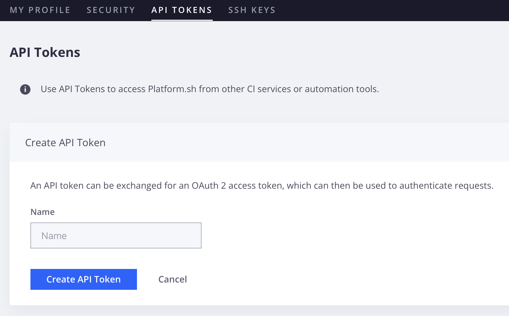

# Manage user access

Adobe Commerce projects on cloud infrastructure use role-based access. There are two roles available at the project level:

- **Project admin**—Write access to all project environments and can manage users, push code, and update project settings. (Previously known as **Super admin**)
- **Project viewer**—View-only access to all project environments.

Project viewers cannot perform tasks on any environment; however, you can grant project viewers write access to a specific environment type.

Environment-level access is based on the environment type: production, staging, and development. Granting a user _viewer_ permission to _development_ environments means that they can view **all** development environments in the project. The following table clarifies the abilities granted to each permission level:

| Permission level | Access | SSH access |
| ---------------- | ------ | :--------: |
| **Admin** | Perform administrator tasks, such as change settings, push code, perform tasks, and branch management, including merging with the parent environment | Yes |
| **Contributor** | Push code and branch the environment; cannot change settings or execute actions | Yes |
| **Viewer** | View-only access to the environment type | No |
| **No access** | No access to the environment type | No |

{style="table-layout:auto"}

You can add users and assign roles using the `magento-cloud` CLI or the [!DNL Cloud Console].

>[!PREREQUISITES]
>
>- A registered user with an Adobe ID. A user must [register for an Adobe account](https://account.adobe.com), and then initialize their [Cloud account](https://console.adobecommerce.com) before you can add them to a Cloud project.
>- A user assigned the **Admin** role cannot manage users with the `magento-cloud` CLI. Only users that are granted the **Account Owner** role can manage users.

## Manage users with the CLI

Use the `magento-cloud` CLI to manage users and integrate with automated systems:

- `magento-cloud user:add`–add a user to the project
- `magento-cloud user:delete`–delete a user
- `magento-cloud user:list [users]`–list project users
- `magento-cloud user:role`–view or change the user role
- `magento-cloud user:update`–update user role on a project

The following examples use the `magento-cloud` CLI to add a user, configure roles, modify project assignments, and assign user roles.

**To add a user and assign roles**:

1. Use the `magento-cloud` CLI to add the user.

   ```bash
   magento-cloud user:add
   ```

   >[!IMPORTANT]
   >
   >The user must have an Adobe ID. See the prerequisites.

1. Follow the prompts: specify the user email address, set the project and environment-type roles, and add the user.

   > Sample prompts

   ```text
   Enter the user's email address: alice@example.com

   Email address: alice@example.com

   The user's project role can be admin (a) or viewer (v).

   Project role (default: viewer) [a/v]: viewer

   The user's environment type role(s) can be admin (a), viewer (v), contributor (c) or none (n).

   Role on type development (default: none) [a/v/c/n]: none
   Role on type production (default: none) [a/v/c/n]: admin
   Role on type staging (default: none) [a/v/c/n]: admin

   Adding the user alice@example.com to (project_id):
   Project role: viewer
     Role on type production: admin
     Role on type staging: admin

   Are you sure you want to add this user? [Y/n] y
   Adding the user to the project
   ```

   After you add the user, Adobe sends an email to the specified address with instructions for accessing the Adobe Commerce on cloud infrastructure project.

### View a user's project role

```bash
magento-cloud user:get alice@example.com
```

>Sample response:

```text
Current role(s) of User (alice@example.com) on Production (project_id):
  Project role: admin
```

### Add a user to multiple environments

To add a user as a `viewer` on a `Production` environment, and as a `contributor` on an `Integration` environment:

```bash
magento-cloud user:add alice@example.com -r production:v -r integration:c
```

### Update user environment permissions

To update user environment permissions to `admin` on the `Production` environment:

```bash
magento-cloud user:update alice@example.com -r production:a
```

## Manage users from the [!DNL Cloud Console]

You can use the [[!DNL Cloud Console]](../../get-started/cloud-console.md) to add permissions and use the _Edit_ feature to modify permissions for an existing user.

>[!IMPORTANT]
>
>The user must have an Adobe ID. See the prerequisites.

### Add a user to the project

1. Log in to the [[!DNL Cloud Console]](https://console.adobecommerce.com/).

1. Select a project from the _All projects_ list.

1. On the Project dashboard, click the configuration icon in the upper right.

1. Under _Project Settings_, click **[!UICONTROL Access]**.

1. In the _Access_ view, click **[!UICONTROL Add]**.

1. Complete the _[!UICONTROL Add User]_ form:

   - Enter the user email address.

   - **[!UICONTROL Project admin]**—grant Admin rights to all settings and environment types.

   - **[!UICONTROL Environment types and permissions]**—grant access and specific permission levels to certain environment types. _No access_, _Admin_ (change settings, execute action, merge code), _Contributor_ (push code), or _Viewer_ (view only).

   >[!TIP]
   >
   >Only a **Project admin** can manage users in any environment. To grant a user access to the **Access** tab, another **Project admin** or the **Account Owner** must assign that user the **Project admin** role.

1. Click **[!UICONTROL Add User]**.

   >[!IMPORTANT]
   >
   >Adding a user does not trigger a deployment automatically.

1. After adding users, redeploy all environments to apply the changes.

   Redeployment ensures the user can access environments using SSH or perform administrator tasks.

After you add the user, Adobe sends an email to the specified address with instructions for accessing the Adobe Commerce on cloud infrastructure project.

### Invitation states

In the [!DNL Cloud Console], an administrator can send an invitation before account initialization is complete. In that case, the access list displays the user with a status such as [!UICONTROL Invite pending]. Access is not fully active until onboarding is completed.

Depending on the console and the user's account state, a user can appear in one of these states:

- **[!UICONTROL Not invited]** — No project access record exists.
- **[!UICONTROL Invite pending]** — An invitation was sent, but account initialization or acceptance is incomplete.
- **[!UICONTROL Active]** — The user completed onboarding and has active project access.

>[!NOTE]
>
>The [!DNL Cloud Console] displays invitation states more explicitly than the [!DNL Legacy Cloud Console] (`https://<region-id>.magento.cloud/projects/<project_id>`). A visible user or invitation entry does not always mean the user can immediately access all environments. SSH key setup or other propagation steps might still be required. See [User authentication requirements](#user-authentication-requirements).

## User authentication requirements

For added security, Adobe provides project-level multi-factor authentication (MFA) enforcement to require two-factor authentication (TFA) for SSH access to Adobe Commerce on cloud infrastructure project source code and environments. See [Enable MFA for SSH](multi-factor-authentication.md).

When MFA enforcement is enabled on an Adobe Commerce on cloud infrastructure project, all users with SSH access to an environment in that project must enable TFA on their Adobe Commerce on cloud infrastructure account. For automated processes, you can create a machine user and API token to authenticate from the command line.

After you add a user to a Cloud project, ask the user to review their account security settings and add the following security configurations as needed:

- **Enable TFA**—Meet security and compliance standards by configuring two-factor authentication. Projects configured with [MFA enforcement](multi-factor-authentication.md) require TFA on accounts that use SSH to access the projects.

- **Enable SSH keys**—Users that require access to Adobe Commerce on cloud infrastructure source code repositories must enable SSH keys on their account. See [Secure connections](../development/secure-connections.md).

- **Create an API token**—Users must generate an API token that is used for SSH access to an environment. You need the token to enable authentication workflows for automated processes.

   On projects with MFA enforcement enabled, you must use the API token to authenticate SSH access requests from automated accounts. The token allows automated processes to bypass authentication workflows which require TFA.

### Enable TFA for Cloud accounts

Adobe Commerce on cloud infrastructure supports TFA using any of the following applications:

- [Google Authenticator (Android/iPhone)](https://support.google.com/accounts/answer/1066447?hl=en)
- [Authy (Android/iPhone)](https://authy.com/features/)
- [FreeOTP (Android)](https://play.google.com/store/apps/details?id=org.fedorahosted.freeotp)
- [GAuth Authenticator (Firefox OS, desktop, others)](https://github.com/gbraad-apps/gauth)

Instructions for installing the authenticator application and enabling TFA are available on the _Account settings_ page in the [!DNL Cloud Console].

**To enable TFA on your user account**:

1. Log in to [your account](https://console.adobecommerce.com).

1. In the upper-right account menu, click **[!UICONTROL My Profile]**.

1. On the _Security_ tab, click **[!UICONTROL Set up application]**.

1. If you do not have an approved authenticator application on your mobile device, use the linked instructions to install one.

1. Add your Adobe Commerce on cloud infrastructure account to the authenticator application.

   - On your mobile device, open the authenticator application. Then, add the setup code to the application.

   - On the **[!UICONTROL TFA set up - Application]** page, type the TFA code from your mobile device in the **[!UICONTROL Application verification code]** field.

   - Click **[!UICONTROL Verify and save]**.

      If the code is valid, Adobe sends a notification to the account email address confirming that the account now has TFA.

1. Optional. Enable _Trusted browser_ settings to cache the authentication code in the browser for 30 days.

   This configuration reduces the number of authentication challenges during project login.

1. Click **Save** or **Skip**.

1. Save the recovery codes.

   - On the _TFA setup - Recovery_ codes page, copy and save the recovery codes so that you can log into your Adobe Commerce on cloud infrastructure project when you cannot access your mobile device or authentication application.

   - Copy the recovery codes to another location or write them down in case you lose access to your device or authentication application.

   - Click **Save** to save the codes to your account so you can view and manage them from your account security settings.

      >[!WARNING]
      >
      >If you lose access to an account with TFA and do not have the recovery codes list, you must contact your project administrator, or [Submit an Adobe Commerce Support ticket](https://experienceleague.adobe.com/docs/commerce-knowledge-base/kb/help-center-guide/magento-help-center-user-guide.html#submit-ticket) to reset the TFA application.

1. After completing the TFA setup, click **Save** to update your account.

1. Authenticate your current session with TFA.

   - Log out of your account.
   - Log in with your username and password.
   - When prompted, enter the TFA code for the `accounts.magento.cloud` entry from the authenticator application on your mobile device.

### Manage TFA configuration and recovery codes

You can manage the TFA configuration for an Adobe Commerce on cloud infrastructure account from the _Security_ section on the _My Profile_ page.

1. Log in to [your account](https://console.adobecommerce.com).

1. In the upper-right account menu, click **[!UICONTROL My Profile]**.

1. On the _My Profile_ page, click the **[!UICONTROL Security]** tab.

1. Use the available links to update the TFA settings for your Adobe Commerce on cloud infrastructure account:

   - Disable TFA
   - Reset the authenticator application
   - Add or remove trusted browsers
   - View or refresh TFA recovery codes on your account

### Create an API token

An API token can be exchanged for an OAuth 2 access token, which can then be used to authenticate requests.

On projects that have MFA enforcement enabled, you must have an API token to enable SSH access for machine users and automated processes.

>[!IMPORTANT]
>
>Protect API token values for your account. Do not expose the value in code samples, screen captures, or insecure client-server communications. Also, do not expose the value in source code stored in public repositories.

**To create an API token**:

1. Log in to [your account](https://console.adobecommerce.com).

1. In the upper-right account menu, click **[!UICONTROL My Profile]**.

1. On the _My Profile_ page, click the **[!UICONTROL API tokens]** tab.

1. Click **[!UICONTROL Create API token]** and enter a name, for example, specify a name that matches the machine user or automated process that uses the API token.

   

1. Click **[!UICONTROL Create API token]**.

## More help on this topic

- [Unable to add user to Adobe Commerce cloud project](https://experienceleague.adobe.com/en/docs/support-resources/adobe-support-tools-guide/adobe-commerce-support/unable-add-user-adobe-commerce-cloud-project) — troubleshooting when adding a user fails.
